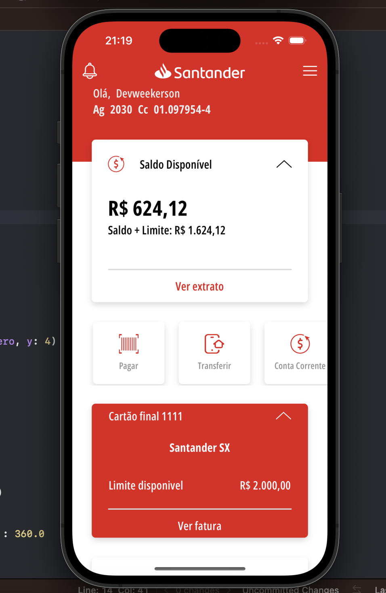
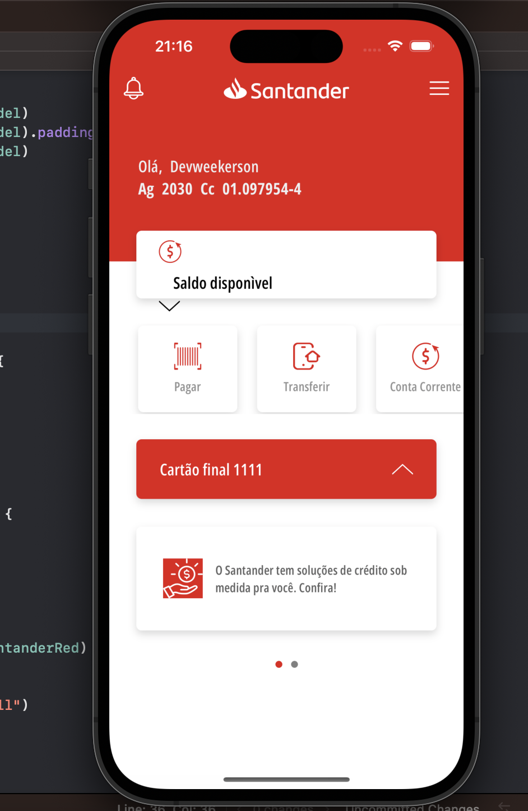

# Banco Santander App Clone - Santander Dev Week 2023





## Sobre o Projeto

O projeto visa recriar a interface e algumas funcionalidades do aplicativo móvel do Banco Santander usando SwiftUI, a linguagem Swift para criação da interface do usuário.

Incluímos algumas das principais telas e componentes do aplicativo original, como a visualização de saldo, detalhes da conta, extrato, transferências, entre outras. O desenvolvimento utiliza a biblioteca SwiftUI para proporcionar uma interface moderna e interativa.

## Funcionalidades

- Visualização do saldo disponível e do limite da conta.
- Detalhes da conta, apresentando informações como agência, número da conta, e outros detalhes relevantes.
- Funcionalidades de Transferência PIX, Pagamento de Boletos e Transferência TED.
- Integração com API simulada ou dados fictícios (Mock da DIO).

## Pré-requisitos

- Sistema operacional MacOS
- XCode 15 ou superior
- Linguagem Swift
- SwiftUI

## Como Executar o Projeto

1. Clone o repositório em sua máquina local utilizando o Git:

```bash
git clone https://github.com/YagoCardoso/SantanderAppCloneSwift.git
```

2. Abra o projeto no XCode.

3. Aguarde o XCode carregar o projeto e sincronizar as dependências.

4. Conecte um dispositivo iOS ao computador ou utilize um emulador.

5. Execute o aplicativo no dispositivo ou emulador selecionando a opção "Run 'app'" no XCode.

## Aviso Legal

Este projeto é um clone do aplicativo do Banco Santander, desenvolvido exclusivamente para fins educacionais e de aprendizado. Não é uma aplicação oficial ou afiliada ao Banco Santander. O uso desta aplicação para fins pessoais e não comerciais é de responsabilidade do usuário.
