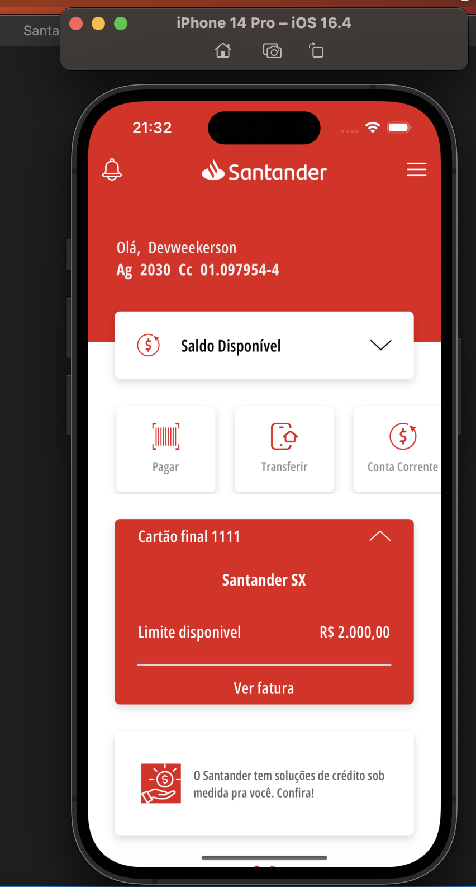

# Banco Santander App Clone utilizando Swift- Santander Dev Week 2023

## Sobre o Projeto

O objetivo deste projeto é recriar a aparência e algumas das funcionalidades do aplicativo móvel do Banco Santander utilizando o SwiftUI para criação da interface do usuário em Swift.

O aplicativo inclui algumas das principais telas e componentes do aplicativo original, como a tela de saldo, detalhes da conta, extrato, transferências, entre outras. O projeto utiliza a biblioteca SwiftUI para criar uma interface moderna e interativa.

## Funcionalidades

- Tela de saldo disponível e o limite da conta.
- Detalhes da conta, exibindo informações como agência, número da conta e outros detalhes.
- Funcionalidade de Transferência PIX, Pagamento de Boletos e Transferência TED.
- Integração com API simulada ou dados fictícios.(Mock da DIO)

## Pré-requisitos

- Sistema operacional MacOS
- XCode 15 ou superior
- Swift Language
- SwiftUI

## Como Executar o Projeto

1. Clone o repositório para sua máquina local utilizando o Git:

2. Abra o projeto no XCode.

3. Aguarde o XCode carregar o projeto e sincronizar as dependências.

4. Conecte um dispositivo iOS ao computador ou utilize um emulador.

5. Execute o aplicativo no dispositivo ou emulador selecionando a opção "Run 'app'" no XCode.

## Aviso Legal

Este projeto é apenas um clone do aplicativo do Banco Santander desenvolvido por razões educacionais e de aprendizado. Não é uma aplicação oficial ou afiliada ao Banco Santander. O uso desta aplicação para fins pessoais e não comerciais é de responsabilidade do usuário.